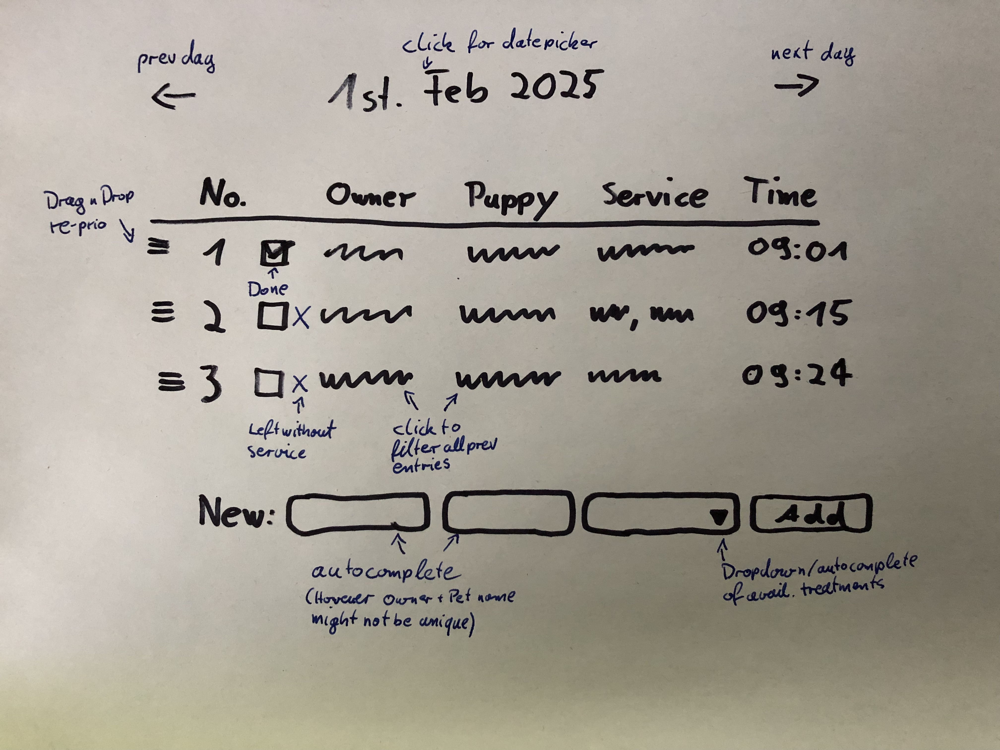

# Puppy Spa

This is a simple waiting list management application suitable for a small puppy spa. see [spec](https://along-hq.notion.site/Puppy-Spa-Waiting-List-App-2025-267ba9624bc349a2bb60e0562850aef3)

Features:

- Add a new customer to the waiting list.
- Change order of list items.
- See previous waiting lists.

It's design goals are:

- Simplicity and usability: avoid complexity and focus on the core features within a minimal interface.
- Easy to manage: the application should be easy to deploy and maintain.
- Modern technology: use current web technologies and best practices even if some of it might not be fully leveraged.

## UI



## Development

First, run the development server:

```bash
pnpm dev
```

Open [http://localhost:3000](http://localhost:3000) with your browser to see the result.
