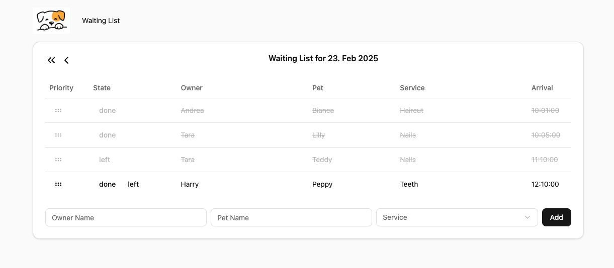

# Puppy Spa

This is a simple waiting list management application suitable for a small puppy spa.

Features:

- Add a new customer to the waiting list.
- Change order of list items.
- See previous waiting lists.
- See treatment history of a puppy.

It's design goals are:

- Simplicity and usability: avoid complexity and focus on the core features within a minimal interface.
- Easy to manage: the application should be easy to deploy and maintain.
- Modern technology: use current web technologies and best practices even if some of it might not be fully leveraged.

## UI



## Architecture

I tried to stick to as few technologies and frameworks as possible to keep the application simple. I choose next.js for the frontend and backend because it allowed me to build a full-stack application with a single language and framework. For styling I used tailwindcss because it's easy to use and doesn't require me to write any CSS. On top I used pre-made components from shadcn-ui to speed up development and get a somewhat polished look by default.

Data is stored in a postgres database. I decided against an ORM to keep things simple and used raw SQL. There are really only a couple of queries. In a bigger application I would most likely use prisma or another ORM.

I tried to use server components where possible and reduce the amount of client side code. This should make the application more robust and easier to maintain. This made the boundaries between backend / frontend / datafetching somewhat more fluent than we would want it to be for bigger applications. Ideally we would have a well defined API surface to build our frontend on.

## Possible improvements

I deliberately left a couple things out that you usually would find in a more real world / production setup:

- Tests: I'm not a big fan of using TDD for frontend apps. However tests help evolving / refactoring a codebase so I definitely would add them in a real project once I'm close to a deployable state.
- authentication / authorization / data encryption / data backup etc.
- Design could be much prettier (real navbar etc)
- Owner name & pet name autocomplete: couldn't find a autocomplete component that worked well enough and didn't want to write my own.
- Pages to edit details of Owners / Pets: would need to talk to customer to understand what useful
- edit existing entries: unclear if that is needed
- Additional toggle button to hide people that left or are done so that the user can focus on the customers still waiting
- Service field potentially should be a multi select.
- ...

## Development

The application is assuming you have `POSTGRES_URL` set so it can connect to the database you want to use.

You can seed an empty database with some test data by running:

```bash
pnpm migrate
```

Then run the development server:

```bash
pnpm dev
```

Open [http://localhost:3000](http://localhost:3000) with your browser to see the result.
